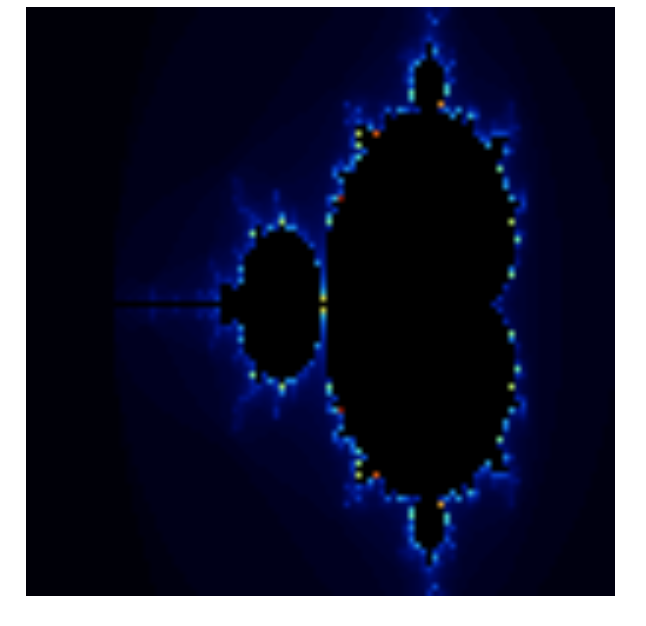

# ORION - A WebAssembly Compiler

# ASTRA - A Low-level Language for Deterministic Execution

```
 ██████╗ ██████╗ ██╗ ██████╗ ███╗   ██╗         █████╗ ███████╗████████╗██████╗  █████╗
██╔═══██╗██╔══██╗██║██╔═══██╗████╗  ██║        ██╔══██╗██╔════╝╚══██╔══╝██╔══██╗██╔══██╗
██║   ██║██████╔╝██║██║   ██║██╔██╗ ██║   +    ███████║███████╗   ██║   ██████╔╝███████║
██║   ██║██╔══██╗██║██║   ██║██║╚██╗██║        ██╔══██║╚════██║   ██║   ██╔══██╗██╔══██║
╚██████╔╝██║  ██║██║╚██████╔╝██║ ╚████║        ██║  ██║███████║   ██║   ██║  ██║██║  ██║
 ╚═════╝ ╚═╝  ╚═╝╚═╝ ╚═════╝ ╚═╝  ╚═══╝        ╚═╝  ╚═╝╚══════╝   ╚═╝   ╚═╝  ╚═╝╚═╝  ╚═╝
      ORION (Compiler)                               ASTRA (Language)

               Compiles directly to WebAssembly
```

---

## Overview

ORION is a compiler written in TypeScript that compiles a custom programming language, ASTRA, directly to WebAssembly (WASM).

ASTRA is a deliberately low-level, expression-based language designed to make execution semantics explicit and observable. The language and compiler were designed together with a single goal: to understand how real programs are lowered into WebAssembly and executed as native bytecode.

The compiler emits raw WebAssembly binary. There is no interpreter, no intermediate WAT representation, and no JavaScript execution once compilation completes. After emission, the program runs entirely inside the WebAssembly virtual machine.

---

## Motivation

WebAssembly is widely used as a compilation target, yet its execution model is rarely explored directly. Most developers rely on mature toolchains that abstract away details such as stack behavior, control-flow construction, and linear memory access.

This project exists to remove that abstraction barrier.

ORION was built to answer concrete questions:

* How are structured loops encoded in WebAssembly bytecode?
* How does a stack machine evaluate nested expressions deterministically?
* How are lexical scopes mapped to local variable indices?
* How do break and continue translate into structured control flow?
* How is linear memory addressed, written to, and shared with the host?

Rather than prioritizing feature breadth, the focus is placed on correctness, determinism, and clarity of execution.

---

## Compiler architecture

```
ASTRA source code
        |
        v
+--------------+
|  Tokenizer   |   Source text -> tokens
+--------------+
        |
        v
+--------------+
|   Parser     |   Tokens -> abstract syntax tree
+--------------+
        |
        v
+--------------+
|   Compiler   |   AST -> WebAssembly bytecode
+--------------+
        |
        v
 WebAssembly module
        |
        v
 Native execution
```

The compiler follows a traditional multi-stage pipeline, but critically there is no runtime interpreter. The AST exists only at compile time. After compilation, execution is performed entirely by the WebAssembly engine.

---

## The ASTRA language

ASTRA is a minimal, expression-based language designed around explicit execution semantics rather than abstraction convenience.

All values are numeric. Control flow is structured. Scoping is lexical and deterministic. There is no hidden runtime behavior.

### Language features

* Arithmetic expressions: +, -, *, /
* Comparison operators: ==, <, >
* Logical conjunction: &&
* Variable declarations and reassignment
* Lexical scoping with correct shadowing behavior
* Explicit block scopes
* Conditional execution via if / else / end
* Looping via while / end
* Structured control flow using break and continue
* Deterministic linear memory access
* Host-imported functions for I/O
* Direct compilation to WebAssembly

### Example program

```astra
let y = 0
while (y < 3)
  let x = 0
  while (x < 3)
    setpixel x y (x + y)
    x = (x + 1)
  end
  y = (y + 1)
end
```

This example exercises nested loops, scoped variables, arithmetic evaluation, branching, and memory writes, all of which are lowered directly into WebAssembly instructions.

---

## Mandelbrot validation

The compiler is validated using a complete Mandelbrot set renderer written entirely in ASTRA.

Mandelbrot is used as a validation workload rather than a visual demo. Rendering it correctly requires:

* deeply nested loops
* heavy floating-point arithmetic
* precise conditional branching
* strict stack discipline
* exact linear memory indexing

Any flaw in expression evaluation, control flow construction, or memory addressing produces visible corruption in the output. The fact that the image renders correctly provides strong evidence that the compiler's execution model is correct.

## Mandelbrot validation




---

## Project structure

```
ORION/
├── src/
│   ├── types/
│   │   ├── compiler.ts     Compiler interfaces and contracts
│   │   ├── parser.ts       AST node type definitions
│   │   ├── runtime.ts      Runtime and host-facing types
│   │   └── tokenizer.ts   Token definitions
│   │
│   ├── wasm/
│   │   ├── constants.ts   WASM opcodes, section identifiers, value types
│   │   ├── encoding.ts    LEB128, IEEE754, and vector encoders
│   │   └── module.ts      WebAssembly module construction
│   │
│   ├── compiler.ts        AST to WASM code generation
│   ├── parser.ts          Recursive descent parser
│   ├── tokenizer.ts       Lexer implementation
│   ├── traverse.ts        AST traversal utilities
│   ├── runtime.ts         WebAssembly host bindings
│   └── index.ts           Public compiler entry point
│
├── index.html              Browser harness and canvas output
├── main.ts                 Mandelbrot runner
│
├── package.json
├── package-lock.json
├── tsconfig.json
├── vite.config.ts
└── .gitignore
```

---

## Design principles

* Minimal surface area to reduce semantic ambiguity
* Explicit execution semantics
* No implicit runtime services
* Correctness prioritized over expressiveness
* WebAssembly treated as a real compilation target

ASTRA is intentionally constrained so that every supported feature can be reasoned about down to its WebAssembly representation.

---

## Status

* Compiler pipeline complete
* Core language complete
* Mandelbrot renderer complete
* Functions intentionally deferred

Functions are a deliberate design decision rather than an incomplete feature.

---

## Running the project

```
npm install
npm run dev
```

Open the browser and run the Mandelbrot demo via the provided harness.

---

## Closing note

This project was built to understand how programs actually execute at the WebAssembly level, rather than how high-level languages present themselves.

ORION and ASTRA are intended to be read, studied, and extended by anyone interested in compilers, execution models, and WebAssembly internals.
