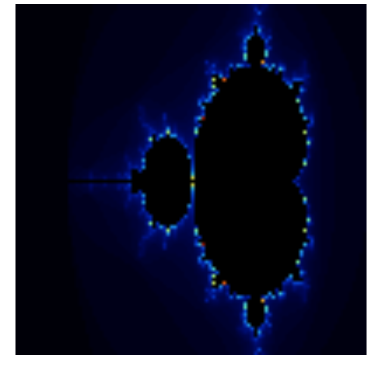

# ORION - A WebAssembly Compiler

# ASTRA - A Low-level Language for Deterministic Execution

```
 ██████╗ ██████╗ ██╗ ██████╗ ███╗   ██╗         █████╗ ███████╗████████╗██████╗  █████╗
██╔═══██╗██╔══██╗██║██╔═══██╗████╗  ██║        ██╔══██╗██╔════╝╚══██╔══╝██╔══██╗██╔══██╗
██║   ██║██████╔╝██║██║   ██║██╔██╗ ██║   +    ███████║███████╗   ██║   ██████╔╝███████║
██║   ██║██╔══██╗██║██║   ██║██║╚██╗██║        ██╔══██║╚════██║   ██║   ██╔══██╗██╔══██║
╚██████╔╝██║  ██║██║╚██████╔╝██║ ╚████║        ██║  ██║███████║   ██║   ██║  ██║██║  ██║
 ╚═════╝ ╚═╝  ╚═╝╚═╝ ╚═════╝ ╚═╝  ╚═══╝        ╚═╝  ╚═╝╚══════╝   ╚═╝   ╚═╝  ╚═╝╚═╝  ╚═╝
      ORION (Compiler)                               ASTRA (Language)

               Compiles directly to WebAssembly
```

<p align="center">
  
  
  
  
</p>

<p align="center">
  <a href="#v1--core-compiler">v1.0 Core</a> |
  <a href="#v2--extended-language--playground">v2.0 Extended</a> |
</p>

---

## Overview

**ORION** is a compiler written in TypeScript that compiles a custom programming language, **ASTRA**, directly to WebAssembly binary bytecode.

ASTRA is a deliberately low-level, expression-based language designed to make execution semantics explicit and observable. The compiler emits raw WebAssembly binary — no interpreter, no intermediate WAT representation, no JavaScript execution after compilation. The program runs entirely inside the WebAssembly virtual machine.

---

## Versions

### v1.0 | Core Compiler

The foundational compiler with essential language features.

| Feature | Description |
|---------|-------------|
| **Tokenizer** | Regex-based lexer with keyword/identifier/operator recognition |
| **Parser** | Recursive descent parser producing typed AST |
| **Emitter** | Direct WebAssembly binary generation |
| **Expressions** | Arithmetic (`+`, `-`, `*`, `/`), comparisons (`==`, `<`, `>`), logical (`&&`) |
| **Variables** | Declaration, assignment, lexical scoping with shadowing |
| **Control Flow** | `if`/`else`/`end`, `while`/`end`, `break`, `continue` |
| **Graphics** | `setpixel x y value` for grayscale canvas output |
| **I/O** | `print` via host-imported function |

### v2.0 | Extended Language + Playground

Significant language extensions and an interactive development environment.

| Feature | Description |
|---------|-------------|
| **Functions** | User-defined functions with parameters, return values, recursion |
| **For Loops** | `for i in start..end` syntax with automatic desugaring |
| **Operators** | `!=`, `<=`, `>=`, `\|\|`, unary `-`, `not` |
| **RGB Colors** | `setpixelrgb x y r g b` for full-color rendering |
| **Dynamic Canvas** | Configurable dimensions (50-500px), dynamic memory allocation |
| **Playground** | Monaco editor, syntax highlighting, live metrics, example library |
| **Bug Fixes** | All 10 original known bugs resolved |

---

## Quick Start

```bash
# Install dependencies
npm install

# Run test suite (51 checks)
npm test

# Type-check the compiler
npm run typecheck

# Start playground
npm run dev
```

Open **http://localhost:5173** for the interactive playground.

---

## Compiler Architecture

```
ASTRA source code
        |
        v
+--------------+
|  Tokenizer   |   Source text -> tokens
+--------------+
        |
        v
+--------------+
|   Parser     |   Tokens -> abstract syntax tree
+--------------+
        |
        v
+--------------+
|   Emitter    |   AST -> WebAssembly bytecode (two-pass for functions)
+--------------+
        |
        v
 WebAssembly module
        |
        v
 Native execution
```

The compiler follows a traditional multi-stage pipeline. The AST exists only at compile time. After compilation, execution is performed entirely by the WebAssembly engine.

---

## The ASTRA Language

ASTRA is a minimal, expression-based language designed around explicit execution semantics.

### Syntax Reference

```astra
// Variables
let x = 5
let y = (x + 10)
x = 42

// Control flow
if (x > 0)
  print x
else
  print 0
end

while (x < 100)
  x = (x + 1)
end

for i in 0..10
  print i
end

// Functions (v2.0)
fn square(x)
  return (x * x)
end

fn factorial(n)
  if (n <= 1)
    return 1
  end
  return (n * factorial((n - 1)))
end

// Graphics
setpixel x y 128              // grayscale
setpixelrgb x y 255 128 0     // RGB color

// Output
print square(7)
```

### Operators

| Category | Operators |
|----------|-----------|
| Arithmetic | `+`  `-`  `*`  `/` |
| Comparison | `==`  `!=`  `<`  `>`  `<=`  `>=` |
| Logical | `&&`  `\|\|`  `not` |
| Unary | `-x` (negation) |

---

## Mandelbrot Validation

The compiler is validated using a complete Mandelbrot set renderer written entirely in ASTRA.

Mandelbrot is used as a validation workload rather than a visual demo. Rendering it correctly requires:

- Deeply nested loops
- Heavy floating-point arithmetic
- Precise conditional branching
- Strict stack discipline
- Exact linear memory indexing

Any flaw in expression evaluation, control flow construction, or memory addressing produces visible corruption in the output.



---

## Project Structure

```
ORION/
├── src/
│   ├── types/
│   │   ├── parser.ts       AST node type definitions
│   │   └── tokenizer.ts    Token definitions
│   │
│   ├── wasm/
│   │   ├── constants.ts    WASM opcodes, section IDs, value types
│   │   ├── encoding.ts     LEB128, IEEE754, vector encoders
│   │   └── module.ts       WebAssembly module construction + emitter
│   │
│   ├── tokenizer.ts        Lexer implementation
│   ├── parser.ts           Recursive descent parser
│   ├── runtime.ts          WebAssembly host bindings
│   └── index.ts            Test suite (51 checks)
│
├── index.html              Playground UI
├── playground.ts           Playground logic + Monaco integration
├── main.ts                 Standalone Mandelbrot runner
│
├── GUIDE.md                Complete implementation guide
├── PLAYGROUND.md           Playground documentation
├── CHANGELOG.md            Version history
└── README.md               This file
```


## Design Principles

- **Minimal surface area** — reduce semantic ambiguity
- **Explicit execution** — no hidden runtime behavior
- **Correctness over expressiveness** — every feature maps cleanly to WASM
- **WebAssembly as real target** — not an afterthought

ASTRA is intentionally constrained so that every supported feature can be reasoned about down to its WebAssembly representation.

---

## Building for Production

```bash
npm run build
```

Outputs static files to `dist/`. Deploy to any static host (Vercel, Netlify, GitHub Pages).

---

## License

MIT

---

## Closing Note

This project was built to understand how programs actually execute at the WebAssembly level, rather than how high-level languages present themselves.

ORION and ASTRA are intended to be read, studied, and extended by anyone interested in compilers, execution models, and WebAssembly internals.
